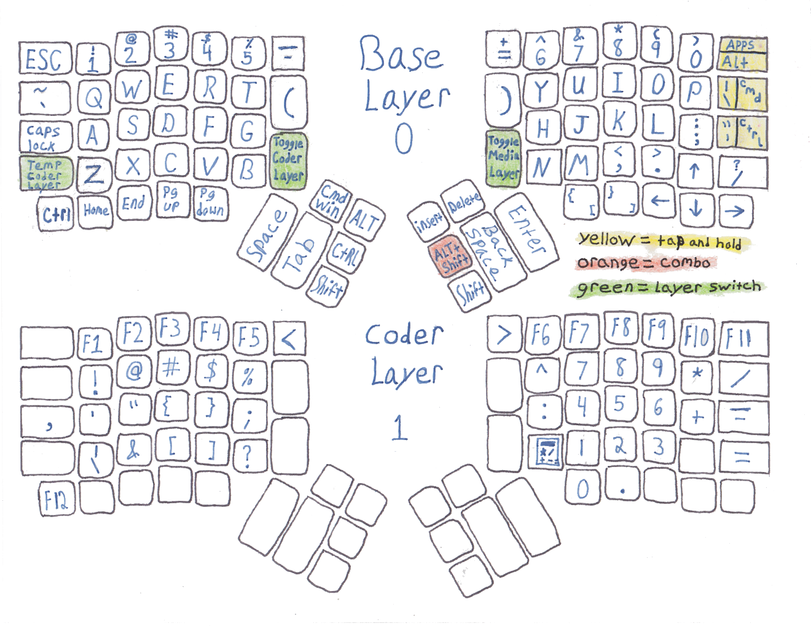
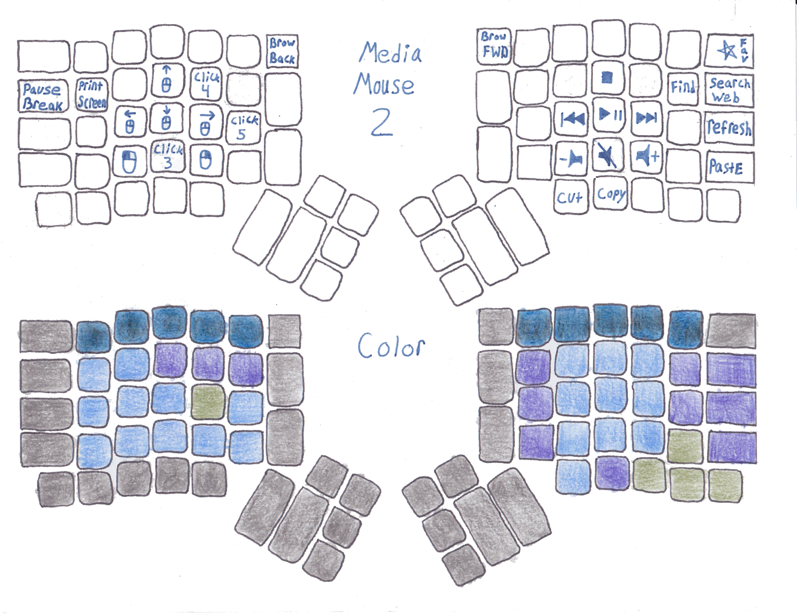

# karrow configuration

* What I did differently:
  * Three finger arrow keys
  * Thumb shift
  * shift ctrl alt cmd/win easy to hit all at once. ctrl + shift(I do that a lot)
  * zzzHome, xEnd, cPgUp, vPoints down
  * <-  +> that was unintintional the similes. There's more, it's neat how it all came together. 
  * Calculator layout in code layer(this is why f12 is in bottom left corner)
  * !@#$%^ in code layer, like 123456
  * added characters in all layers(see images below)

Those printable png files are great. Useful if you just want a hard copy or to help design your own layout. Rotate once before printing. I suggest using a Pilot Frixion Erasable pen. These pens erase clean and write bold if you write slowly. You can then scan the finish product with a photo scanner (I used my printer's) and share with friend or for all to see!  

