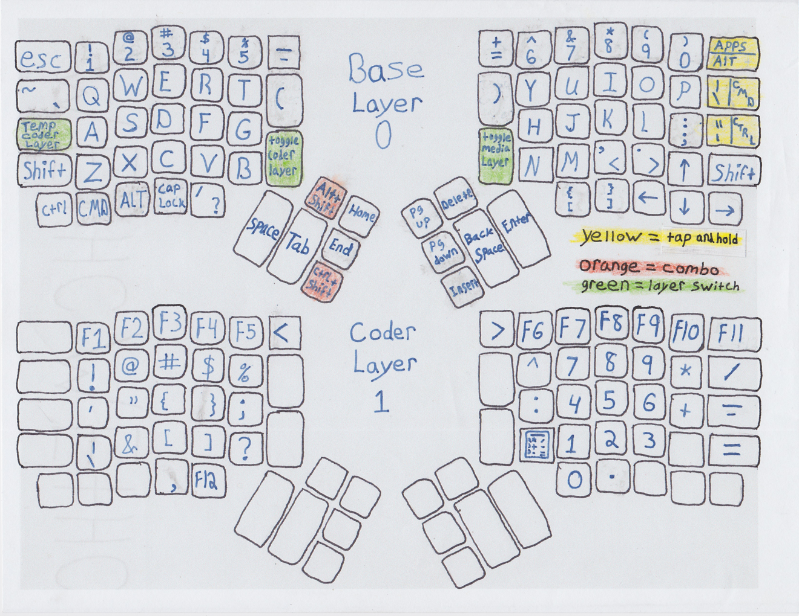
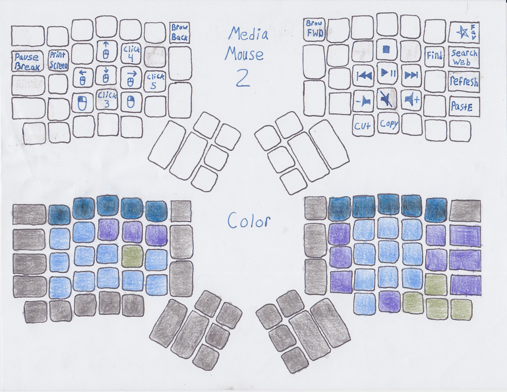

# karrow configuration

* What I did differently:
  * Three finger arrow keys
  * The traditional shift forced ?/ to be moved in a strange location. The V points to it if that helps. V also points to f12.
  * C points to caps lock and comma. cool?
  * shift ctrl alt cmd/win easy to hit all at once. Had to have ctrl + shift so I removed alt + shift.
  * <-  +> that was unintintional the similes. There's more, it's neat how it all came together. 
  * Calculator layout in code layer(this is why f12 is at bottom)
  * !@#$%^ in code layer, like 123456
  * added characters in all layers(see images below)

