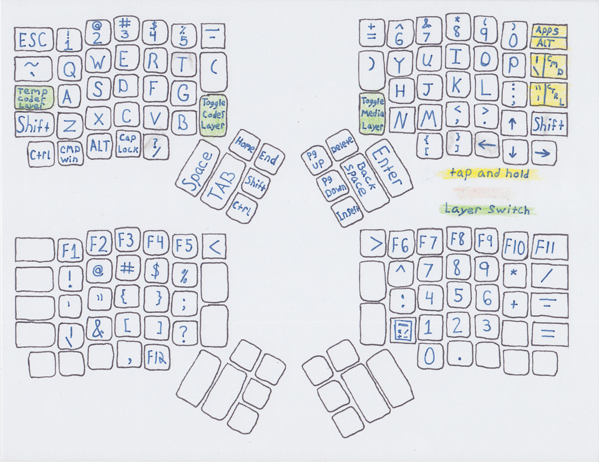

# karrow2 configuration

* What I did differently:
  * Three finger arrow keys
  * brought back left traditonal control characters
  * The traditional shift forced ?/ to be moved in a strange location. The V points to it if that helps. 
  * Calculator layout in code layer(this is why f12 is at bottom) V also points to f12.
  * C points to caps lock and comma. cool?
  * Had to have ctrl shift junction so I removed alt + shift. Useful with arrows and bs.
  * less than & zoom out & -;  greater than & zoom in & +. kinda goes together.
  * !@#$%^ in code layer, like 123456
  * added characters in all layers(see images below) gota have insert.

